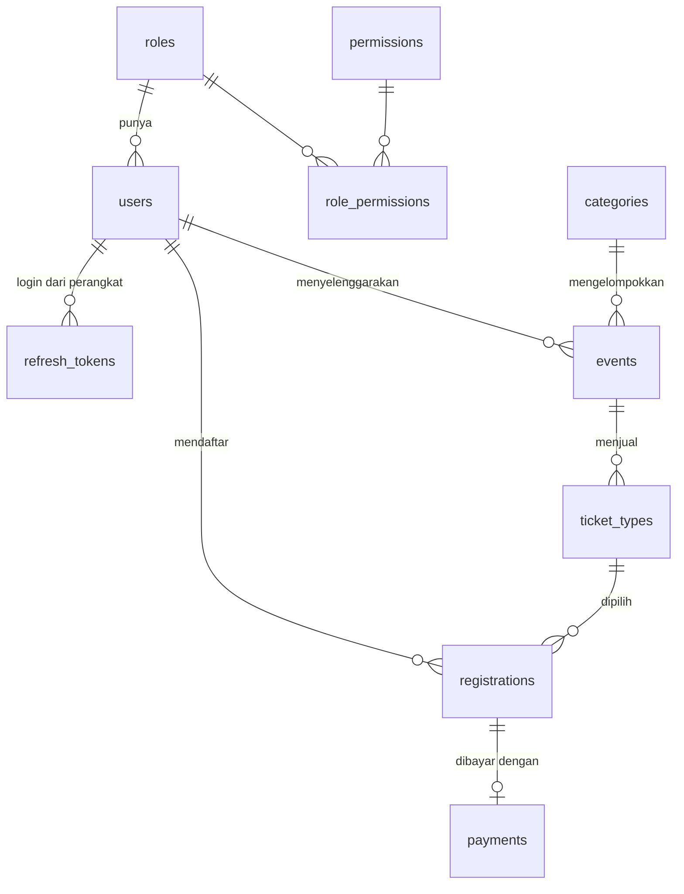

# Ide Project: Eventra API

Event Registration & Ticketing Backend, dibuat dengan Go + Fiber v2 + PostgreSQL.

## 1. Satu keputusan penting dulu: stack harus Go, bukan Node

Soal tugas memberi contoh struktur `src/controllers`, `prisma/schema.prisma`, `app.js`. Itu contoh generik.
Modul dosen (Modul 1–7) memakai Go + Fiber v2 + pgx + PostgreSQL, dan soal tugas sendiri bilang
"bila beda dengan modul, prioritaskan modul dosen". Jadi:

| Di soal (contoh generik) | Yang dipakai (sesuai modul) |
|---|---|
| Node.js, Express, Prisma | Go, Fiber v2, pgx/v5 |
| `controllers/`, `validators/`, `utils/` | `app/service` (peran controller), tag `validate` di `app/model`, `helper/` |
| `DATABASE_URL` | `DB_HOST`, `DB_PORT`, `DB_USER`, ... (seperti Modul 3) |
| Postman / test endpoint | Unit test business rules (Modul 4) + Postman collection + matriks hak akses (Modul 6) |

Kalau ada keraguan, cek ke dosen satu kali: "Project akhir tetap Go Fiber seperti modul, kan?"

## 2. Kenapa Eventra

Tema event dipilih karena tiap materi modul punya tempat yang wajar, bukan ditempel:

- Ada STATE yang berubah (registrasi: pending, confirmed, checked_in, cancelled), jadi business rules benar-benar ada.
- Ada KUOTA, jadi constraint database dan transaksi punya alasan nyata (Modul 3).
- Ada tiga pihak dengan hak berbeda, jadi RBAC dan ownership tidak dibuat-buat (Modul 6).
- Ada DAFTAR yang tumbuh (event, peserta), jadi cursor pagination masuk akal, dan ada kebutuhan ekspor CSV
  untuk daftar hadir, jadi content negotiation masuk akal (Modul 7).
- Domainnya mudah dijelaskan ke dosen dalam satu kalimat dan mudah didemokan lewat Postman.

Alternatif yang dipertimbangkan:

| Tema | Kenapa tidak dipilih |
|---|---|
| Perpustakaan | Terlalu mirip tugas "CRUD buku + pinjam"; state machine dan kuota lebih sederhana |
| Marketplace | Cakupan terlalu besar (keranjang, stok, ongkir, pembayaran) untuk mahasiswa semester 5 |
| Klinik / reservasi | Mirip Eventra, tapi jadwal slot dokter lebih rumit (overlap waktu) |

## 3. Gambaran sistem

**Masalah:** pendaftaran event lewat chat dan form manual membuat kuota jebol, peserta ganda, dan verifikasi pembayaran tanpa jejak.

**Aktor dan role:**

| Role | Bisa apa |
|---|---|
| admin | Kelola user dan role, kategori, melihat dan mengubah semua event dan registrasi |
| organizer | Buat event, kelola tiket event miliknya, verifikasi pembayaran, check-in, ekspor daftar peserta |
| participant | Cari event, daftar, kirim bukti pembayaran, batalkan (maks H-24), lihat registrasi sendiri |

**Alur utama:**

```
organizer buat event (draft) -> tambah jenis tiket -> publish
participant daftar -> (gratis: langsung confirmed) | (berbayar: pending -> kirim referensi -> organizer verifikasi -> confirmed)
hari acara: organizer check-in pakai ticket_code -> checked_in
```

**Fitur:** auth lengkap (register, login, refresh, logout, me), manajemen user dan role, CRUD kategori, CRUD event
(PUT dan PATCH) dengan siklus status, jenis tiket dengan kuota, pendaftaran dengan verifikasi pembayaran, check-in,
ekspor CSV, 35 endpoint total.

## 4. Entitas (ringkas; detail lengkap di PRD bagian 6)

10 tabel: `roles`, `permissions`, `role_permissions`, `users`, `refresh_tokens`, `categories`, `events`, `ticket_types`, `registrations`, `payments`.



## 5. Mapping Modul 1–7 ke Eventra

### Modul 1 — Sintaks Go dan Fiber dasar

| Materi | Implementasi di Eventra | Lokasi |
|---|---|---|
| Variabel, konstanta, zero value | Konstanta status (`StatusPending`, `StatusConfirmed`, ...) dan nama role | `app/model/*.go` |
| Struct, method, value vs pointer receiver | Method kecil pada entitas, mis. `Registration.IsActive()` (value), `Registration.MarkCancelled(now)` (pointer, mengubah isi) | `app/model/registration.go` |
| Struct tag dan `json:"-"` | `Password` tidak pernah keluar sebagai JSON; tag `validate` | `app/model/user.go` |
| Map sebagai set | `PermissionSet` memakai `map[string]map[string]struct{}`; whitelist sort | `helper/authz.go`, `app/repository` |
| Pointer | Field pointer pada request PATCH dan `price` (membedakan "tidak dikirim" dari 0) | `app/model/*_request.go` |
| Slice | Hasil query daftar, pemotongan baris `limit+1` untuk cursor | `app/repository`, `app/service` |
| Channel | Sinyal `os.Signal` pada graceful shutdown | `main.go` |
| Fiber dasar, `app.Group`, `c.Params`, `c.Query`, `BodyParser` | Seluruh route dan service | `route/`, `app/service/` |

### Modul 2 — REST API dan HTTP

| Materi | Implementasi | Lokasi |
|---|---|---|
| Metode HTTP tepat, safe/idempotent | `PUT /registrations/:id/payment` (idempotent, ganti isi), `POST` untuk membuat, `DELETE` 204 | `route/route.go` |
| PUT vs PATCH | Event: PUT wajib semua field, PATCH pointer; Users sama | `app/model`, `app/service` |
| Status HTTP lengkap | 200, 201, 204, 400, 401, 403, 404, 406, 409, 415, 422, 429, 500, 503 | seluruh API |
| Header: Location, X-Request-Id, Retry-After, WWW-Authenticate | `Location` pada setiap 201, `requestid` middleware | `helper/response.go`, `middleware` |
| URL sumber daya (jamak, maks 2 tingkat, versi) | `/api/v1/events/:id/registrations` | `route/route.go` |
| Query string: page, limit (maks 100), search, sort (whitelist), order, filter | `GET /users`, `GET /categories`, `GET /registrations` | `helper/request.go` |
| Envelope konsisten + `meta` | `{success,message,data,meta}` | `helper/response.go` |
| `RequireJSON` per grup, 415 | Semua grup yang menerima body | `middleware/middleware.go` |

### Modul 3 — Database dan Repository Pattern

| Materi | Implementasi | Lokasi |
|---|---|---|
| PostgreSQL + pgx + connection pool + Ping | Pool dengan `DB_MAX_CONNS`, ping saat start | `database/postgres.go` |
| Migrasi SQL | 5 file migrasi bernomor | `migrations/` |
| Query berparameter, whitelist ORDER BY | Semua repository | `app/repository/*.go` |
| Interface repository + implementasi | `UserRepository`, `EventRepository`, `RegistrationRepository`, ... | `app/repository/` |
| Sentinel error, terjemah error pgx | `ErrNotFound`, `ErrDuplicate`, `ErrConflict` (23505, 23503, 23514) | `app/repository/errors.go` |
| Constraint di database | UNIQUE (lower), partial UNIQUE registrasi aktif, `CHECK (sold <= quota)`, FK RESTRICT | `migrations/` |
| Filter, ILIKE, COUNT, LIMIT/OFFSET di SQL | Daftar user, kategori, registrasi | `app/repository` |
| Context timeout, `defer rows.Close()` | `helper.RequestContext` | `helper/request.go` |
| `.env`, `.env.example` | Tersedia | root |

### Modul 4 — Clean Architecture

| Materi | Implementasi | Lokasi |
|---|---|---|
| Struktur baku `app/{model,repository,service}`, `config`, `database`, `helper`, `middleware`, `route`, `logs` | Persis seperti modul | root |
| Dependency rule | Tabel impor di AGENTS.md, diperiksa dengan `go list -deps` dan `grep` | semua |
| Business rules murni + unit test | `*_rules.go` tanpa Fiber: transisi status, batas H-24, jendela check-in, kuota, ownership | `app/service/*_rules.go` |
| Logger terstruktur + rotasi file | slog JSON ke stdout dan `logs/app.log` (lumberjack) | `config/logger.go` |
| Middleware global (requestid, recover, helmet, cors, logger) | Urutan sesuai modul | `middleware/middleware.go` |
| Perakitan di `config/app.go`, `main.go` hanya urutan perakitan + graceful shutdown | Sesuai modul | `config/app.go`, `main.go` |
| Pemeriksaan kebocoran layer | Dibuktikan di laporan | AGENTS.md bagian 8 |

### Modul 5 — Authentication dan Security

| Materi | Implementasi | Lokasi |
|---|---|---|
| bcrypt cost 12, salt | Hash saat register | `helper/security.go` |
| JWT HS256, claims sub/role/iss/iat/exp | Access token 15 menit | `helper/jwt.go` |
| Cek algoritma eksplisit (algorithm confusion) | Di keyfunc `Parse` | `helper/jwt.go` |
| Refresh token acak, disimpan SHA-256, rotasi, logout | Tabel `refresh_tokens` | `app/repository/token_repository.go`, `app/service/auth_service.go` |
| User enumeration (dummy hash, pesan sama) | Login | `app/service/auth_service.go` |
| Rate limiter login (429 + Retry-After) | 5/menit/IP | `middleware/auth.go` |
| Mass assignment | Struct request tanpa `role`; role register dari server | `app/model/auth.go` |
| Secret >= 32 karakter, tolak start | Cek di `main.go` | `main.go` |
| BodyLimit, CORS allowlist, `WWW-Authenticate` | Config Fiber dan middleware | `config/app.go`, `middleware/` |

### Modul 6 — Authorization dan RBAC

| Materi | Implementasi | Lokasi |
|---|---|---|
| Tabel `roles`, `permissions`, `role_permissions` + FK `users.role` | Migrasi 001 | `migrations/001_rbac.sql` |
| `PermissionSet` dimuat sekali, `Can()` fail closed | Dimuat di `main.go`, exit bila gagal | `helper/authz.go` |
| `RequirePermission` (dan pembanding `RequireRole`) | Dipasang per route | `middleware/authz.go`, `route/route.go` |
| Ownership di service, fungsi murni | `CanAccessUser`, `CanManageEvent`, `CanReadRegistration`, `CanManageRegistration` | `app/service/authz_rules.go` |
| Periksa hak sebelum ambil data | Endpoint users | `app/service/user_service.go` |
| Tidak boleh ubah role / hapus diri sendiri | `PATCH /users/:id/role`, `DELETE /users/:id` | `app/service/user_service.go` |
| 401 vs 403, `user_id` dan `role` di log, permission di `/auth/me` | Seluruh API | `middleware`, `app/service` |
| Matriks hak akses + pengujian negatif | `docs/MATRIX_HAK_AKSES.md` | docs |

### Modul 7 — Advanced API Design

| Materi | Implementasi | Lokasi |
|---|---|---|
| Validasi deklaratif (tag), validator dibuat sekali, custom rule, `RegisterTagNameFunc` | Semua struct request | `helper/validator.go`, `app/model` |
| `omitnil` untuk PATCH | PatchUser, PatchEvent | `app/model` |
| Cursor pagination (keyset, `limit+1`, index gabungan) | `GET /events`, `GET /events/:id/registrations` | `helper/cursor.go`, `app/repository` |
| Offset vs cursor: kapan memakai yang mana | Offset untuk tabel admin (butuh total), cursor untuk feed dan daftar peserta | `docs/PRD.md` bagian 10 |
| Content negotiation (JSON/CSV, 406, `*/*`) | Ekspor daftar peserta | `helper/negotiate.go` |
| `AppError`, ErrorHandler terpusat, `code`, `request_id`, `cause` tidak bocor | Seluruh handler mengembalikan error | `helper/errors.go`, `config/app.go` |
| 4xx WARN, 5xx ERROR, status access log benar | Logger dan ErrorHandler | `middleware`, `config/app.go` |
| Daftar periksa C.8 (14 butir) | Dibuktikan di fase 5 | docs |

## 6. Hal yang harus kamu kuasai sebelum presentasi

1. Jelaskan satu request dari ujung ke ujung: `POST /events/12/registrations` lewat middleware mana, service mana, query apa, error apa yang mungkin.
2. Kenapa `CHECK (sold <= quota)` lebih kuat daripada `if sold >= quota` di Go (Modul 3).
3. Kenapa ownership tidak bisa di middleware (Modul 6 C.4), dengan contoh dari kode sendiri.
4. Bedanya 401, 403, 404 pada event draft, dan kenapa event draft dijawab 404.
5. Kenapa cursor memakai `created_at` dan `id`, bukan `starts_at`.
6. Kenapa 422 untuk "capacity lebih kecil dari jumlah kuota" tapi 409 untuk "kuota habis".
7. Satu kerentanan yang masih tersisa dan cara menutupnya (Modul 5 bagian 5): role di JWT basi sampai 15 menit.

## 7. Urutan kerja yang disarankan

F0 fondasi, F1 auth, F2 RBAC dan users, F3 event dan tiket, F4 registrasi dan check-in, F5 review, F6 pengujian, F7 dokumentasi.
Setelah F4 produknya sudah utuh. Kalau waktu mepet, P1 di PRD boleh dipotong, fase lain tidak.
Prompt per fase ada di `03_PROMPT_ANTIGRAVITY.md`.


</USER_REQUEST>
<ADDITIONAL_METADATA>
The current local time is: 2026-10-05T18:42:23+07:00.
</ADDITIONAL_METADATA>
<USER_SETTINGS_CHANGE>
The user changed setting `Model Selection` from None to Claude Sonnet 4.6 (Thinking). No need to comment on this change if the user doesn't ask about it. If reporting what model you are, please use a human readable name instead of the exact string.
</USER_SETTINGS_CHANGE>
